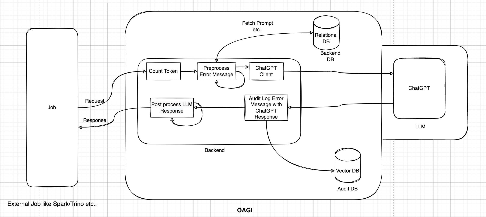

# OAGI
Operational Artificial General Intelligence 

### OAGI - Gen Zero/(toddler)
- Generally, whenever a process fails by doing its given task, if there is retry mechanism is defined for the process, it can try no. of retry times with the hope of errors would be recovered and it can function and finish its given task. Sometime errors are recoverable from retry while sometime non recoverable. For example, in orchestrator like airflow whose job is to scheduled the workflow and its tasks, for individual task we define the no. of retry whenever task fails doing its job. Another example, in micro services, if one micro service is trying to reach out to another micro service for the information and if it's not reachable, it retries for certain no. of times with some intervals. 
- Actually, most of the time, process doesn't have the sense/understanding of the error like it is recoverable or non recoverable and whether it should retry and shouldn't retry! 
- The retry mechanism is nothing but pure human optimism! The expectation behind the adding blind retry mechanism is that before it is being declared, it should have retried irrespective of the error is recoverable or non recoverable. 
- <ins>Problem</ins>: there are thousands of jobs running every day and they consume cores, memories, storages & network bandwidth to full-fill their functional goals; those cores, memories, storages & network bandwidth are having the cost based on usage; if those processes are unnecessarily retried and rerun in a circumstance where errors are non recoverable, business has to pay unnecessary cost for those resources consumed by processes.
- <ins>Possible Solution</ins>: before retrying, the process asks for the opinion from the OAGI service which is powered by LLM(Large Language Model) which has given the enough knowledge of what kind of exceptions/errors are re-triable and non re-triable.
- <ins>High level solution diagram 1</ins>: 
  
- <ins>High level solution diagram 2</ins>: 
  

### OAGI - Gen One/(pre-schooler)
- In this phase of the life, OAGI may not only classify the error types but it can understand the error and summarise them as well. 
- <ins>Problem</ins> : In case of non recoverable errors, the process finally decides not to recover from retry and go into fail state and eventually, this decision is being notified to the responsible person. The responsible person gets the notification and it can act immediately but it has to go through many logins and error analysis process, root cause analysis, to come up with precise solution plus sometime, person is unknown to the tech stack of the process, it may take more time in accumulating the knowledge from the peers as well as from the google search before recovering the process. Apparently, the process stays in fail state which may cost to the business.
- <ins>Possible Solution</ins>: When business process asks for classification of the errors, like recoverable or non recoverable, to the OAGI service, the OAGI service summarises the error and its possible recovery solutions with precise message in case of non recoverable error and later it can publish/notify to the responsible person/channel which apparently, empowers the responsible person to act fast. (Here, the LLM of OAGI service will be empowered with enough knowledge of the errors and their respective possible recovery steps.)
- <ins>High level solution diagram</ins>:
    
### OAGI - Gen One/(pre-schooler)
- In this phase of the life, OAGI may perform basic recovery step by itself.
- <ins>Problem</ins>: On instance of the process failure, until process gets the person attention and it is being recovered which takes the time and apparently, costs to the business. 
- <ins>Possible Solution</ins>: The OAGI service may execute certain level of basic remedy tasks to recover the process from the failure state until responsible person takes the matter in its hand. The LLM of OAGI service will be empowered with enough knowledge of deciding the certain kind of try methods for the given situation. The OAGI service may invoke another service by asking to perform certain action against failed process and it also records the output of such action so responsible person comes online, it can be empowered with information like what have been tried and their respective outcomes. For example, in case of replication service, from exception message, OAGI service may suspect that Alluxio master is unavailable; it may ask the defined external service for such task to check the availability of the given URL and perform ping kind of operation and return the result, which OAGI service may record the response and sends it to the notification service which may help the responsible person to evaluate the error.
- <ins>High level solution diagram</ins>: 
  
### OAGI - Gen Three/(teenage)
- In this phase of the life, OAGI may perform various recovery steps in sequence/workflow manner to recover the process from the failure state.
- <ins>Problem</ins>: The responsible person may not have all the tech stack knowledge or sometime it may have the knowledge but may not sure like where to start or may need some knowledgeable guess in its work etc.. It seeks some external knowledge to speed up or support it. 
- <ins>Possible Solution</ins>: The OAGI service may accumulate vast amount of knowledge to suggest the possible recovery steps with deep knowledge of the subject or execute certain kind of recovery tasks in workflow manner. For example, if OAGI classifies that spark job fails due to less executor memory, it can propose the new spark resource config and ask external service to execute the spark job with that new resource config; if it still fails with new resource config, it suggests new resource config with more increasing memory and ask external service to execute the spark job. This suggesting new resource config may continue for certain period of time until responsible person comes online and interrupts it or define no. of times probably.
- <ins>High level solution diagram</ins>: It should be same as school-aged but LLM will be enriched with more information plus more external services can be added to execute certain kind of ops related tasks.

### OAGI - Gen Four/(adult)
- In this phase of the life, OAGI may become equivalent to responsible person in terms of knowledge and executing recovery task. 
- <ins>Problem</ins>: The responsible guy's non availability or prompt/immediate response time which keeps the process in failure state which eventually costs to the business 
- <ins>Possible Solution</ins>: Almost replace the responsible guy with OAGI service (wink) Apparently, the responsible person may have more productive time and nobody will have to bother him/her on weekends or during its vacation time! Just it has to keep enriching the LLM knowledge. 
- <ins>High level solution diagram</ins>: It should be same as teenage but LLM will be enriched with more information plus more external services can be added to execute certain kind of ops related tasks.

## General thoughts
- The idea, I described here is probably in general operational observability sense; however, it can be blend for particular kind of operational observability problem like data observability/data ops if LLM has been given the knowledge about data related process problems and its recovery information plus surrounded by data ops related external services to execute different data and its job related tasks asked by OAGI service.
- This idea is also like framework; with enrichment of LLM knowledge plus creating/enhancing ops recovery task related external services may increase its maturity. 

