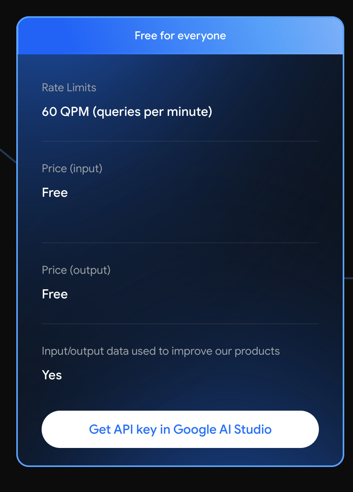
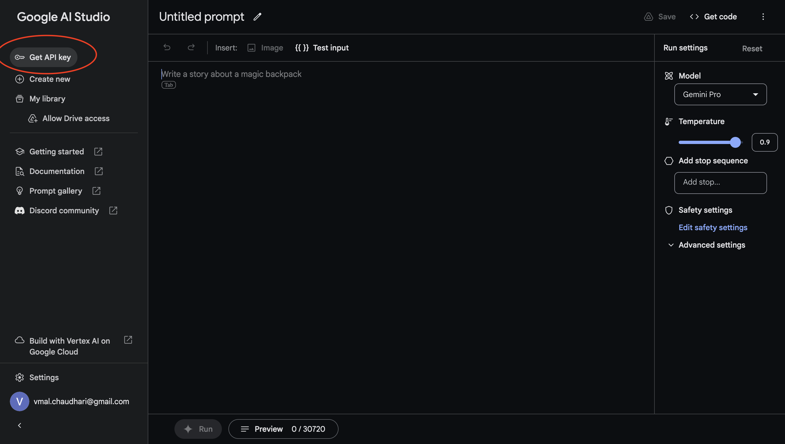
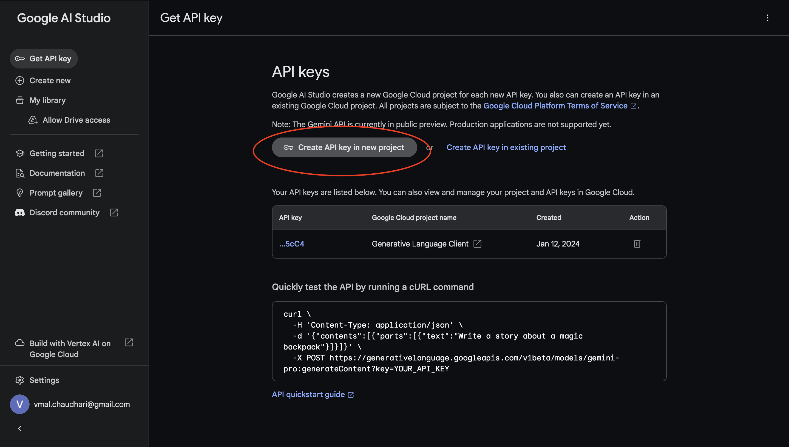

# Welcome to OAGI Toddler POC

The Google Gemini Pro API is free to use. We can use it to conceptulise the OAGI toddler idea.
Reference: [Gemini Pricing](https://ai.google.dev/pricing)


### Get Gemini API key
We need to obtain the Google Gemini API key to use its API from our code.

- Login with your Gmail account in your browser and use same session for accessing Gemini related resources.
- Visit [Google AI Studio](https://makersuite.google.com/)
- Click on button, Get API Key, in left corner.
   
- Then Click on button, Create API key in new project.
  
- It will show you onetime created API KEY which you need to store.
- If you find above steps difficult, you can find plenty of supporting tutorials online.

### Install python Gemini dependency 
- use python 3.9 and above 
```
# gemini client 
pip install google-generativeai

# for poc work, building rest interface
pip install Flask
```
- [Reference doc](https://ai.google.dev/tutorials/python_quickstart)

### POC understanding
- There is python script named, server.py, which conceptualised the OAGI toddler and it has API/end point called retry which takes the error json as input/request and response/reply back with retry probability.
- Request json
    ```
    {'error': '[base64 encoded exception string]' }
    ```
- Response json
    ```
    {'retry': '[Retry probability in float]' }
    ```
- There is python script named, client.py, which conceptualised the OAGI toddler client process and it is actually trying to access the some website but getting timeout error and it needs to make the decision like whether it should retry or stop retry the accessing website and for that decision, it takes the help of OAGI toddler, server.py. 
- First, run the server.py 
    ```
    python server.py
    ```
- Then, run client.py
    ```
    python client.py
    ```
- For the given error/exception, Gemini LLM replies the probability for retry around 0.5 or 50%. As per code, client.py, line no. 27, if the probability is greater than 0.5 then only it will retry else it will stop doing retry.
    ```
           if t['retry'] > 0.5:
               recoverable=True
           else:
               recoverable=False
    ```
- Just to play around, reduce the retry criteria in client.py code, line no. 27. You will see the client.py code will keep retrying the website.
    ```
           if t['retry'] >= 0.5:
               recoverable=True
           else:
               recoverable=False
    ```
- Cool. you have explored smart/intelligent retry mechanism instead of having blind retry.

### What does this POC teach us ?
We write our code in a deterministic manner. So it has defined behaviour and it behaves in a certain manner which can be described as flow chart diagram. While if you see our/human brain, it is very dynamic and it acts as probabilistically rather than determinstically. For example, for code to make decision, we write if..else, basically, it takes code flow to certain direction based on pre-defined conditions while we make our decision by considering many situations/conditions into account and make probabilistic direction/decision. This code represents the blending of both types of nature, deterministic + probabilistic ! 